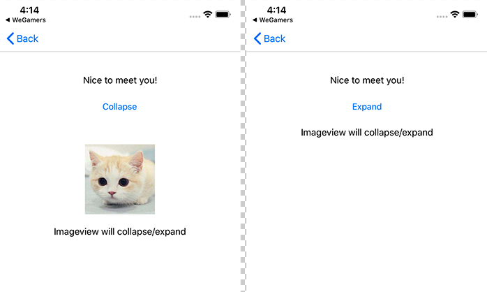

# TMMasonryExtends

TMMasonryExtends 是一个 [Masonry](https://github.com/SnapKit/Masonry) 扩展库，可以用它为视图显示和隐藏状态设置不同的约束。

封装这个库主要是为了解决视图显示、隐藏的时候引入的大量条件判断和约束变更的代码。

效果图：



## Usage

引入头文件

``` objc
#import <TMMasonryExtends/TMMasonryExtends.h>
```

Masonry 扩展接口

``` objc
@interface MASConstraint (TMExtends)

/**
 view 隐藏时自动将约束值设置为 0，显示时恢复原值
 */
- (MASConstraint * (^)(UIView *view))tm_collapseWhenHidden;

/**
 view 隐藏时安装此约束，反之卸载
 */
- (MASConstraint * (^)(UIView *view))tm_installWhenHidden;

/**
 view 显示时安装此约束，反之卸载
 */
- (MASConstraint * (^)(UIView *view))tm_installWhenShow;

@end
```

示例

``` objc
#import <TMMasonryExtends/TMMasonryExtends.h>

[self.imageView mas_makeConstraints:^(MASConstraintMaker *make) {
    // self.imageView 隐藏时，顶部间距自动设置为 0
    make.top.equalTo(self.btnToggle.mas_bottom).offset(50).tm_collapseWhenHidden(self.imageView);
    // self.imageView 隐藏时，高度设置为 0
    make.height.mas_equalTo(0).tm_installWhenHidden(self.imageView);
    // self.imageView 显示时，高度设置为 120
    make.height.mas_equalTo(120).tm_installWhenShow(self.imageView);
    make.height.with.equalTo(self.imageView.mas_width);
    make.centerX.mas_offset(0);
}];
```

## Requirements

iOS 8.0

## Installation

TMMasonryExtends is available through [CocoaPods](https://cocoapods.org). To install it, simply add the following line to your Podfile:

```ruby
pod 'TMMasonryExtends', '~> 1.0'
```

## Author

lxb_0605@qq.com

## License

TMMasonryExtends is available under the MIT license. See the [LICENSE](LICENSE) file for more info.
